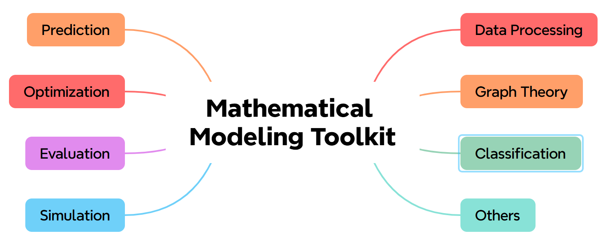

# Mathematical-Modeling-Toolkit

  

  

本仓库聚焦于帮助同学们备战各类数模竞赛，收集整理了数学建模与数据分析的常用脚本，按主题分类存放，方便查找和复用。内容包括优化类、预测类、评价类、图论、数据处理基础、仿真等方向，均为python实现，易于上手。

## 功能模块

本项目包含以下核心模块，涵盖了数学建模中常用的各类算法与模型：

### 1. 评价模型 (evaluation)
提供多种综合评价方法，用于解决多指标决策与排序问题。
* **AHP层次分析法** 适用于具有递阶结构的复杂决策问题
* **TOPSIS综合评价法** 基于与理想解距离的排序方法，包含改进算法
* **熵权法 (EW)** 基于数据信息熵确定权重的客观赋值法
* **灰色关联分析 (GRA)** 分析序列间相似性与关联度
* **模糊综合评价 (FCE)** 处理模糊性信息的综合评判方法
* **秩和比 (RSR)** 综合评价与分档

### 2. 预测分析 (prediction)
涵盖回归、时间序列及神经网络等多种预测手段。
* **回归分析** 一元/多元线性回归、非线性回归、岭回归、LASSO回归、逻辑回归
* **时间序列分析** ARIMA模型、Prophet模型、指数平滑
* **灰色预测** GM(1,1)模型及其改进
* **机器学习/深度学习** BP神经网络、CNN、RNN、LSTM、XGBoost、高斯过程回归

### 3. 优化算法 (optimization)
包含传统规划与现代启发式算法，求解各类最优化问题。
* **传统规划** 线性规划 (LP)、非线性规划 (NLP)、整数规划 (IP)、0-1规划、目标规划
* **启发式算法** 遗传算法 (GA)、粒子群算法 (PSO)、模拟退火 (SA)、蚁群算法 (ACO)、鲸鱼优化 (WOA)、天牛须搜索 (BAS)、萤火虫算法 (FA)
* **多目标优化** NSGA-II、多目标线性规划

### 4. 分类与聚类 (classification)
用于数据挖掘与模式识别。
* **聚类算法** K-Means、DBSCAN、层次聚类、GMM
* **分类算法** 决策树、随机森林、支持向量机 (SVM)、朴素贝叶斯、K近邻 (KNN)

### 5. 数据处理 (data_processing)
提供数据预处理与特征工程工具。
* **降维算法** 主成分分析 (PCA)、线性判别分析 (LDA)、奇异值分解 (SVD)、因子分析
* **插值与拟合** 各类插值方法、数据分布拟合
* **预处理** 标准化、归一化、缺失值处理、异常值检测、MK趋势检验

### 6. 图论模型 (graph_theory)
解决图网络结构相关问题。
* **路径规划** Dijkstra、Floyd等最短路径算法
* **生成树** Prim、Kruskal最小生成树算法
* **网络流与遍历** 图的遍历、网络优化

### 7. 模拟仿真 (simulation)
基于随机过程与动力学的模拟方法。
* **蒙特卡洛模拟** 随机抽样与概率模拟
* **动力学模型** 传染病模型 (SI/SIS/SIR)、阻滞增长模型
* **排队论** 排队服务系统仿真
* **元胞自动机** 地形建模、二维分布模拟

## 致谢

本仓库是基于开源社区的杰出工作进行的集成与整理。我们深知开源不易，特此向以下原始仓库的作者及贡献者致以最诚挚的感谢：

- **[MCM-ICM](https://github.com/FelixYuan-YF/MCM-ICM)**: 本仓库集成了该项目的 Python 实现代码，感谢 FelixYuan-YF 的整理与分享。
- **[Mathematical-modeling-model](https://github.com/leost123456/Mathematical-modeling-model)**: 参考了其中的多种数学建模模型实现。
- **[Mathematical-Modeling](https://github.com/Lanrzip/Mathematical-Modeling)**: 参考了部分经典算法的实现。

此外，部分资料来源于网络资源与公开数据集，在此一并感谢原作者的contributions。本仓库旨在为数学建模学习者提供一个便捷的、即插即用的模型代码工具箱，如有侵权请联系删除。
